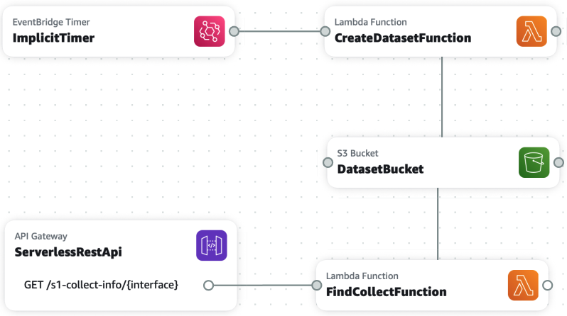

# s1_collect_info
A utility for determining the next Sentinel-1 collection date for a given set of parameters. You can either search by SLC scene name to get the date of the next interferometrically valid collection to pair with the scene you specified, or by latitude/longtitude to get the next collection date regardless of orbit parameters.

## Usage
First run the `create_collection.py` script to scrape the collection data from [ESA's Acquisition Segments website](https://sentinel.esa.int/web/sentinel/missions/sentinel-1/observation-scenario/acquisition-segments), and parse the output as a geojson.

```bash
python s1_collection_info/create_collection.py
```
This will create a geojson that looks like this:


Then you can call the main application using a variety of inputs:

```bash
python s1_collection_info/app.py scene --scene S1A_IW_SLC__1SDV_20180405T023745_20180405T023812_021326_024B31_FBCC-SLC
python s1_collection_info/app.py location --lon 2.4 --lat 48.8
python s1_collection_info/app.py location --lon 2.4 --lat 48.8 --mode IW
```

## AWS Deployment
Alternatively, you can deploy the application as an API using the included SAM template by running:

```bash
sam build
sam deploy --guided
```

Then you can call you API with the following syntax:
```bash
https://{YOUR_API_URL}/Prod/s1-collect-info/scene?scene=S1A_IW_SLC__1SDV_20180405T023745_20180405T023812_021326_024B31_FBCC-SLC
https://{YOUR_API_URL}/Prod/s1-collect-info/location?lon=2.4&lat=48.8
https://{YOUR_API_URL}/Prod/s1-collect-info/location?lon=2.4&lat=48.8&mode=EW
```

This application's stack uses a lambda that is triggered daily to produce the updated geojson file, which it then stores in S3. When the API is called, a second Lambda is triggered that retrieves the geojson from S3 and computes the nearest future collection date for your parameters. See the architecture diagram below:

